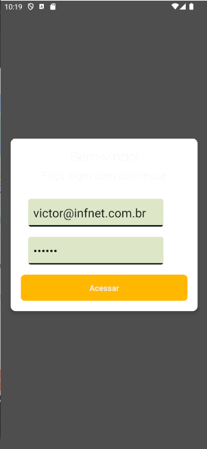
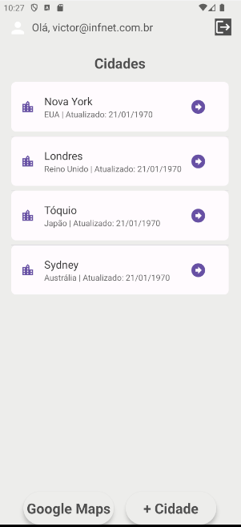
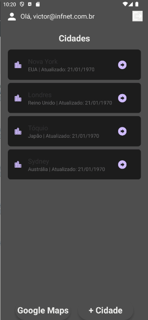
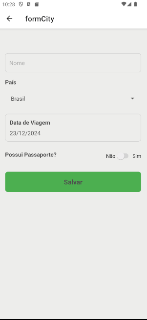
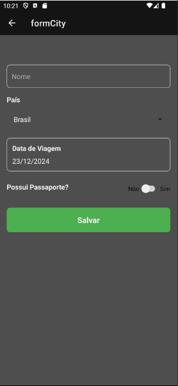
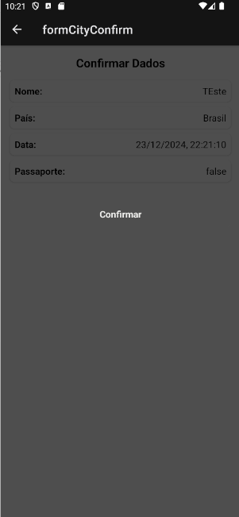
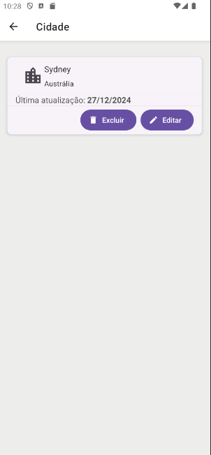
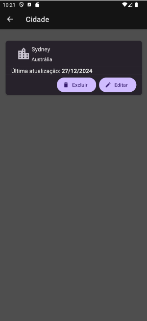

# Victor Pereira Aguiar

Integrações Back-end e Publicação de Apps React Native [24E4_3]

## Prints do aplicativo

Print Tela Login

Print Tela Inicial LIGHT

Print Tela Inicial DARK

Print Tela FORMULARIO LIGHT

Print Tela FORMULARIO DARK

Print Tela CONFIRMA FORMULARIO LIGHT

Print Tela CONFIRMA FORMULARIO DARK

Print Tela VISUALIZAR CIDADE LIGHT

Print Tela VISUALIZAR CIDADE DARK

